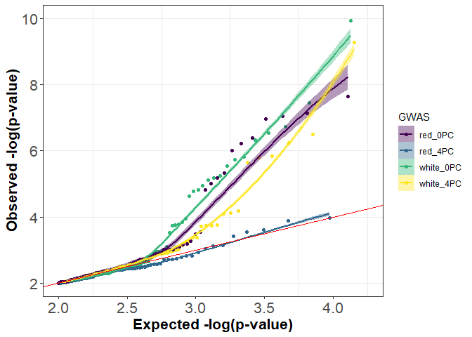
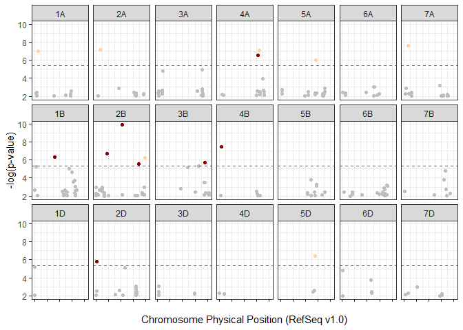
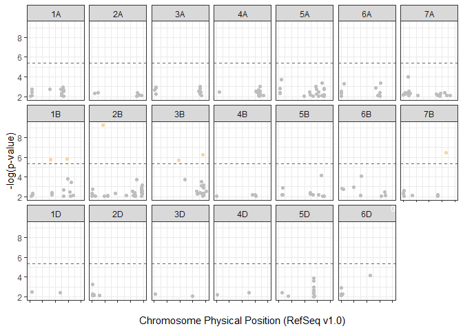

CNL GWAS PHS
================
S.A. Martinez
2020.04.14

**Genome-wide association analysis** of the Cornell Master elite nursery for the Preharvest Sprouting trait using the spike-wetting tests.

> All files in referenced in this document can be downloaded from [CNL\_GWAS\_GP2020](https://github.com/shantel-martinez/CNL_GWAS_GP2020).
> Users will need the following in the same working directory as this CNL\_GWAS\_PHS.Rmd file: [myGD.csv](https://github.com/shantel-martinez/CNL_GWAS_GP2020/blob/master/myGD.csv), [myGM.csv](https://github.com/shantel-martinez/CNL_GWAS_GP2020/blob/master/myGM.csv), and [allMasterDatawithOHMI\_June2017miss30.RData](https://github.com/shantel-martinez/CNL_GWAS_GP2020/blob/master/allMasterDatawithOHMI_June2017miss30.RData)

This analysis follows the [CNL\_Prep\_Stats\_PHS](https://github.com/shantel-martinez/CNL_GWAS_GP2020/blob/master/CNL_Prep_Stats_PHS.md) analysis in the [CNL\_GWAS\_GP2020](https://github.com/shantel-martinez/CNL_GWAS_GP2020) project. The environment should contain only the following dataframes:

``` r
load("./CNL_Prep_Stats_PHS.RData")
rm(list= ls()[!(ls() %in% c('PHScGIDblup','PHSwGIDblup','PHSrGIDblup','PHSWhiteComplete','PHSCombComplete','PHSRedComplete'))])
```

If these dataframes are **not** in the current environment, open the [CNL\_Prep\_Stats\_PHS.Rmd](https://github.com/shantel-martinez/CNL_GWAS_GP2020/blob/master/CNL_Prep_Stats_PHS.Rmd) file and run all coding chunks. *Be sure to have all the corresponding input files needed to run*
OR Download the [CNL\_Prep\_Stats\_PHS.Rdata](https://github.com/shantel-martinez/CNL_GWAS_GP2020/blob/master/CNL_Prep_Stats_PHS.RData) files from github, save in the working directory this CNL\_GWAS\_PHS.Rmd is in.

PHS Genotype Files
------------------

Genotyping was conducted using genotyping-by-sequencing on the Illumina HiSeq 2000. 11,604 population-based SNP markers were identified after a 30% missing data and a 5% minor allele frequency filter was applied. [N. Santantonio et al., 2019](http://www.genetics.org/content/early/2019/01/24/genetics.118.301851) curated, imputed, and filtered the genotypic data. The `allMasterDatawithOHMI_June2017miss30.RData` file was given to me by N. Santantonio.

Impute the genotpye dataframe `Ximp` and renamed it `myGD`:

``` r
load("../Data Input/allMasterDatawithOHMI_June2017miss30.RData")
# myGD headers: SNP Marker1 Marker2 ... MarkerN
myGD<- Ximp + 1 
rm(pheno, snpInfo, X, Ximp, XnoHet, README)
write.csv(myGD, "./myGD.csv",row.names=TRUE)
```

Ximp is coded as: -1 is homozygous major allele, 0 is heterozygous, and 1 is homozygous minor allele.
`Ximp + 1` changes the code to 0,1,2.

This may not be the most efficent way to add in the taxa names into the first column, but I found that if I write `myGD` as a csv file, then read it back in as `myGD`, it is now a dataframe rather than a large matrix and includes the first column as the GIDs (or genotype names).

``` r
myGD <- read.csv("../Data Input/myGD.csv", head = TRUE,na.string=c(""," ","NA","na","NaN"))
rownames(myGD) = myGD[,1]
myGD[1:4,1:4]
```

    ##                 X S1A_PART1_1197644 S1A_PART1_1238021 S1A_PART1_2991302
    ## cuGS1       cuGS1                 0                 0                 0
    ## cuGS10     cuGS10                 0                 0                 0
    ## cuGS100   cuGS100                 0                 0                 0
    ## cuGS1000 cuGS1000                 0                 0                 0

### Summary of GIDs in study

Summary of GIDs per location with genotypic data

``` r
library("dplyr")
```

    ## Warning: package 'dplyr' was built under R version 3.5.3

    ## 
    ## Attaching package: 'dplyr'

    ## The following objects are masked from 'package:stats':
    ## 
    ##     filter, lag

    ## The following objects are masked from 'package:base':
    ## 
    ##     intersect, setdiff, setequal, union

``` r
PHSComb1 <- subset(PHSCombComplete, GID %in% myGD$X)
c<-PHSComb1 %>%
  group_by(Year, Loc) %>%
  summarize(Comb = length(unique(GID)))

PHSWhite1 <- subset(PHSWhiteComplete, GID %in% myGD$X)
w<- PHSWhite1 %>%
  group_by(Year, Loc) %>%
  summarize(White = length(unique(GID)))
PHSred1 <- subset(PHSRedComplete, GID %in% myGD$X)
r<- PHSred1 %>%
  group_by(Year, Loc) %>%
  summarize(Red = length(unique(GID))) 
a <- cbind(c,w,r) 

a %>%
  dplyr::select(Year, Loc, Comb, White, Red)
```

    ## # A tibble: 24 x 5
    ## # Groups:   Year [9]
    ##    Year  Loc      Comb White   Red
    ##    <chr> <chr>   <int> <int> <int>
    ##  1 2010  Helfer    171   116    55
    ##  2 2010  Ketola    208   151    57
    ##  3 2010  Snyder    204   147    57
    ##  4 2011  Helfer    263   190    73
    ##  5 2011  Ketola    266   199    67
    ##  6 2011  McGowen   263   200    63
    ##  7 2012  Helfer    259   180    79
    ##  8 2012  Ketola    266   189    77
    ##  9 2012  Snyder    250   179    71
    ## 10 2013  Helfer     80    51    29
    ## # ... with 14 more rows

Table1: Unique genotypes per environment.

``` r
PHSWhite1 <- subset(PHSWhiteComplete, GID %in% myGD$X)
a <- PHSWhite1 %>%
  group_by(Year) %>%
  summarize(White = length(unique(GID)))
PHSRed1 <- subset(PHSRedComplete, GID %in% myGD$X)
b <- PHSRed1 %>%
  group_by(Year) %>%
  summarize(Red = length(unique(GID)))%>%
  rename(Year.1 = Year) 
c <- cbind(a,b)
c%>%
  dplyr::select(Year, White, Red) 
```

    ##   Year White Red
    ## 1 2010   177  58
    ## 2 2011   277  90
    ## 3 2012   332 107
    ## 4 2013   127  41
    ## 5 2014   120  84
    ## 6 2015   342 165
    ## 7 2016   174 187
    ## 8 2017    74  97
    ## 9 2018    25  21

Table2 : Summary of the unique lines tested for Preharvest Sprouting across years

``` r
PHSComb1 <- subset(PHSCombComplete, GID %in% myGD$X)
PHSWhite1 <- subset(PHSWhiteComplete, GID %in% myGD$X)
PHSred1 <- subset(PHSRedComplete, GID %in% myGD$X)

c <- PHSComb1 %>%
  group_by(Loc) %>%
  summarize(Comb = length(unique(GID)))

w <- PHSWhite1 %>%
  group_by(Loc) %>%
  summarize(White = length(unique(GID)))%>%
  rename(Loc.1 = Loc) 

r <- PHSred1 %>%
  group_by(Loc) %>%
  summarize(Red = length(unique(GID))) %>%
  rename(Loc.2 = Loc)

a <- cbind(c,w,r) 
a %>%
  dplyr::select(Loc, Comb, White, Red) 
```

    ##       Loc Comb White Red
    ## 1  Helfer  813   524 289
    ## 2  Ketola  811   535 276
    ## 3 McGowen  575   389 186
    ## 4  Snyder  687   438 249

Table3 : Summary of the unique lines tested for Preharvest Sprouting across locations

``` r
PHSComb1 <- subset(PHScGIDblup, GID %in% myGD$X)
c<-PHSComb1 %>%
  summarize(Comb = length(unique(GID)))
PHSWhite1 <- subset(PHSwGIDblup, GID %in% myGD$X)
w<- PHSWhite1 %>%
  summarize(White = length(unique(GID)))
PHSred1 <- subset(PHSrGIDblup, GID %in% myGD$X)
r<- PHSred1 %>%
  summarize(Red = length(unique(GID))) 
a <- cbind(c,w,r) 
a
```

    ##   Comb White Red
    ## 1 1043   730 313

Table4 : Summary of the unique lines tested for Preharvest Sprouting overall

All of these summary values were combined into one table in the publication referred to as **Table 1**.

------------------------------------------------------------------------

### Align Geno and Pheno files

In order to run a GWAS, the genetic dataframe `myGD`, and the phenotypic dataframes `PHSwGIDblup` need to have the same GID names within each dataframe. Typical to a general breeding program, there are some GID lines that were not genotyped. There are also some GID lines that are only in the red kernel phenoypic dataset and need to be excuded from the `myGD` dataframe, and vice versa for the white dataframe.

This section organizes each white, red, and comb phenotypic subset and their cooresponding `myGD`.

``` r
myGDc <- subset(myGD, X %in% PHScGIDblup$GID)
PHScGIDblup <- subset(PHScGIDblup, GID %in% myGDc$X)

myGDr <- subset(myGD, X %in% PHSrGIDblup$GID)
PHSrGIDblup <- subset(PHSrGIDblup, GID %in% myGDr$X)

myGDw <- subset(myGD, X %in% PHSwGIDblup$GID)
PHSwGIDblup <- subset(PHSwGIDblup, GID %in% myGDw$X)

names(myGDc)[1] <- "GID"
names(myGDr)[1] <- "GID"
names(myGDw)[1] <- "GID"
names(PHScGIDblup)[1] <- "BLUP_Comb"
names(PHSrGIDblup)[1] <- "BLUP_Red"
names(PHSwGIDblup)[1] <- "BLUP_White"
```

Save the current phenotypic files

``` r
write.csv(PHSwGIDblup,file = "./CNL_GWAS_PHS_files/White_SproutBLUPs_20200409.csv", row.names = FALSE)
write.csv(PHSrGIDblup,file = "./CNL_GWAS_PHS_files/Red_SproutBLUPs_20200409.csv", row.names = FALSE)
```

GWAS
----

### Input File Prep

For good version control practice, I always save a new analysis in a folder with the date. It does lead to multiple iterations of a GWA analysis, but it also allows for you to go back and compare different versions.

``` r
setwd("./20200409/")
```

Package Loading
Note: must be connected to the internet to load GAPIT and FarmCPU

``` r
# source("https://bioconductor.org/biocLite.R")  #Needed to install multtest for the first time
# biocLite()
# biocLite("multtest")
library("multtest")
library("gplots")
library("LDheatmap")
library("genetics")
library("scatterplot3d")
library("compiler")
source("http://www.zzlab.net/GAPIT/emma.txt")
source("http://www.zzlab.net/GAPIT/gapit_functions.txt")
library ("bigmemory")     
library("biganalytics")
source("http://zzlab.net/FarmCPU/FarmCPU_functions.txt")
```

Define `myY` and `myGD` based on the GAPIT manual:

> `myY` Taxa names should be in the first column of the phenotypic data file and the remaining columns should contain the observed phenotype from each individual. Missing data should be indicated by either "NaN" or "NA".
> `myGD` The first row is a header file with SNP names, and the first column is the taxa name. `myGM` The first column is the SNP id, the second column is the chromosome, and the third column is the base pair position `myGD` and `myGM` must be in the same order

``` r
myGM<-read.csv("../Data Input/myGM.csv", head = TRUE,na.string=c(""," ","NA","na","NaN"))
myGM$X <- NULL
myGM$chrom <- as.character(myGM$chrom)
myGM$chrom[which(myGM$chrom == "1A")] <- "1"
myGM$chrom[which(myGM$chrom == "2A")] <- "2"
myGM$chrom[which(myGM$chrom == "3A")] <- "3"
myGM$chrom[which(myGM$chrom == "4A")] <- "4"
myGM$chrom[which(myGM$chrom == "5A")] <- "5"
myGM$chrom[which(myGM$chrom == "6A")] <- "6"
myGM$chrom[which(myGM$chrom == "7A")] <- "7"

myGM$chrom[which(myGM$chrom == "1B")] <- "8"
myGM$chrom[which(myGM$chrom == "2B")] <- "9"
myGM$chrom[which(myGM$chrom == "3B")] <- "10"
myGM$chrom[which(myGM$chrom == "4B")] <- "11"
myGM$chrom[which(myGM$chrom == "5B")] <- "12"
myGM$chrom[which(myGM$chrom == "6B")] <- "13"
myGM$chrom[which(myGM$chrom == "7B")] <- "14"

myGM$chrom[which(myGM$chrom == "1D")] <- "15"
myGM$chrom[which(myGM$chrom == "2D")] <- "16"
myGM$chrom[which(myGM$chrom == "3D")] <- "17"
myGM$chrom[which(myGM$chrom == "4D")] <- "18"
myGM$chrom[which(myGM$chrom == "5D")] <- "19"
myGM$chrom[which(myGM$chrom == "6D")] <- "20"
myGM$chrom[which(myGM$chrom == "7D")] <- "21" 
myGM$chrom <- as.numeric(myGM$chrom)
```

Both the red and white nurseries in every environment were planted side by side, however the red kernel set was tested 7 days after physiological maturity (PM) while the white kernel set was tested 5 days after PM. The different days of testing is done because the red kernel genotypes are typically more dormant than white genotypes, as you can see in the phenotypic plot made above (the red dataset spouting less in general). To adjust for this, we let the red kernel germplasm age two more days to break more dormancy, however even with the extra after-ripening period, the red kernel dataset still sprouts less. After careful consideration, I have decided not to analyze the red and white kernel data sets together for publication.

Downstream, the GWA analysis will be looped to analyze all just the White, and Red as one command. That is why we made `myGD` and `myY` lists of the two dataframes.

``` r
myGD = list(myGDw, myGDr)
PHSrGIDblup <-  PHSrGIDblup[c("GID", "BLUP_Red" , "KC")]
PHSwGIDblup <-  PHSwGIDblup[c("GID", "BLUP_White" , "KC")]
myY = list(PHSwGIDblup , PHSrGIDblup)

#checking data frame dimensions
dim(myGM)  
```

    ## [1] 11604     3

``` r
dim(myGD[[1]])
```

    ## [1]   730 11605

``` r
dim(myY[[1]])
```

    ## [1] 730   3

### GAPIT

Lets start with GLM and MLM GWAS in GAPIT.
The documentation for `GAPIT` is found [online](http://www.zzlab.net/GAPIT/gapit_help_document.pdf) and is good at explaining the line-by-line commands.

``` r
setwd("./20200409/YrHarv_4PC")
name <- list("White", "Red")
for (i in 1:2){        
  myYx <- myY[[i]]
  myGDx <- myGD[[i]]
  myGAPIT <- GAPIT(Y=myYx[,c(1,2)],GD=myGDx,GM=myGM,PCA.total=4,
                   group.from=1,group.to=1,group.by=10,
                   memo= paste("GLM_",i,sep=""),Major.allele.zero=TRUE)
  myCV <- read.csv("GAPIT.PCA.csv") 
  write.csv(myCV,paste("GAPIT.PCA_",name[[i]],".csv",sep=""))
  
  myGAPIT <- GAPIT(Y=myYx[,c(1,2)],GD=myGDx,GM=myGM,PCA.total=4,
                   group.from=nrow(myYx),group.to=nrow(myYx),group.by=10,
                   memo= paste("MLM_",i,sep=""),Major.allele.zero=TRUE)
}
```

For FarmCPU, I want to use the principal component output from GAPIT, therefore I need to save a unique csv file for each subset by reading the GAPIT output PCA file `myCV <- read.csv("GAPIT.PCA.csv")` and rewriting with a unique name: `write.csv(myCV,paste("GAPIT.PCA_",name[[i]],".csv",sep=""))`
Many GWAS use PC as covariates calculated from GAPIT to reduce false positives caused by non-genetic effect such as environmental effect.

``` r
myCVr <- read.csv("./20200409/YrHarv_4PC/GAPIT.PCA_Red.csv")
myCVw <- read.csv("./20200409/YrHarv_4PC/GAPIT.PCA_White.csv")
myCVr$taxa <- NULL
myCVw$taxa <- NULL
myCVr$X <- NULL
myCVw$X <- NULL
myCV <- list(myCVw, myCVr)
```

``` r
setwd("./20200409/YrHarv_0PC")
name <- list("White", "Red")
for (i in 1:2){        
  myYx <- myY[[i]]
  myGDx <- myGD[[i]]
  myGAPIT <- GAPIT(Y=myYx[,c(1,2)],GD=myGDx,GM=myGM,PCA.total=0,
                   group.from=1,group.to=1,group.by=10,
                   memo= paste("GLM_",i,sep=""),Major.allele.zero=TRUE)
  myGAPIT <- GAPIT(Y=myYx[,c(1,2)],GD=myGDx,GM=myGM,PCA.total=0,
                   group.from=nrow(myYx),group.to=nrow(myYx),group.by=10,
                   memo= paste("MLM_",i,sep=""),Major.allele.zero=TRUE)
}
```

### FarmCPU

The documentation for `FarmCPU` is found [online](http://www.zzlab.net/FarmCPU/FarmCPU_help_document.pdf).

> `myGD` The first row is a header file with SNP names, and the first column is the taxa name.
> `myY` and `myGM` are the same set up as GAPIT

No PC

``` r
setwd("./20200409/YrHarv_0PC")

WhiteFarmCPU <- FarmCPU(
Y=PHSwGIDblup[,c(1,2)],
GD=myGDw,
GM=myGM
)

RedFarmCPU <- FarmCPU(
Y=PHSrGIDblup[,c(1,2)],
GD=myGDr,
GM=myGM
)
```

4 PC's

``` r
setwd("./20200409/YrHarv_4PC")

WhiteFarmCPU <- FarmCPU(
Y=PHSwGIDblup[,c(1,2)],
GD=myGDw,
GM=myGM,
CV=myCVw
)

RedFarmCPU <- FarmCPU(
Y=PHSrGIDblup[,c(1,2)],
GD=myGDr,
GM=myGM,
CV=myCVr
)
```

### Q-Q plots

GAPIT and FarmCPU automatically output qq plots post analysis. This is to plot all GWA analyses onto one ggplot.

NOTE: that farmCPU only outputs results where the -log(p) &gt; 2.0 which is why the plot starts at 2.0

``` r
white4 <- read.csv("./20200409/YrHarv_4PC/FarmCPU.BLUP_White.GWAS.Results.csv", head = TRUE)
N1 <- length(white4$P.value) #this is the length of your gwas pvalues which is = your marker No.
expected <- sort( (-log10( c(1:N1) * (1/N1) ) )+2) #this like uniform distribution
observed <- sort( -(log10(white4$P.value))) #the df with the -log10(p) values
white4df <- as.data.frame(cbind(expected, observed))
white4df$KC <- "White"
white4df$PC <- "4"
white4df$GWAS <- "white_4PC"
QQ_df <- white4df


white0 <- read.csv("./20200409/YrHarv_0PC/FarmCPU.BLUP_White.GWAS.Results.csv", head = TRUE)
N1 <- length(white0$P.value)
expected <- sort( (-log10( c(1:N1) * (1/N1) ) )+2) 
observed <- sort( -(log10(white0$P.value))) 
white0df <- as.data.frame(cbind(expected, observed))
white0df$KC <- "White"
white0df$PC <- "0"
white0df$GWAS <- "white_0PC"


red4 <- read.csv("./20200409/YrHarv_4PC/FarmCPU.BLUP_Red.GWAS.Results.csv", head = TRUE)
N1 <- length(red4$P.value) 
expected <- sort( (-log10( c(1:N1) * (1/N1) ) )+2)  
observed <- sort( -(log10(red4$P.value)))  
red4df <- as.data.frame(cbind(expected, observed))
red4df$KC <- "red"
red4df$PC <- "4"
red4df$GWAS <- "red_4PC"


red0 <- read.csv("./20200409/YrHarv_0PC/FarmCPU.BLUP_Red.GWAS.Results.csv", head = TRUE)
N1 <- length(red0$P.value)  
expected <- sort( (-log10( c(1:N1) * (1/N1) ) )+2)  
observed <- sort( -(log10(red0$P.value))) 
red0df <- as.data.frame(cbind(expected, observed))
red0df$KC <- "red"
red0df$PC <- "0"
red0df$GWAS <- "red_0PC"

QQ_df <- rbind(QQ_df, white0df, red4df, red0df)

library("ggplot2")
ggplot(data = QQ_df, aes(x = expected, y = observed, color = GWAS))+
  geom_point()+
  geom_smooth(aes(group=GWAS))+
  geom_abline(intercept = 0, color = "Red")+
  scale_colour_viridis_d()+
  ylim(2,10)+xlim(2,4.25)+theme_bw()+
  ylab("Observed -log(p-value)") + xlab("Expected -log(p-value)")+
  theme(panel.grid.major.x = element_blank(),
          panel.grid.minor.y = element_blank(),
          axis.text = element_text(size = 16),  
          axis.title = element_text(face = "bold",  size = 16), 
          strip.text.x = element_text(face = "bold",  size = 16),
          plot.title = element_text(face = "bold",  size = 16),
          # legend.position="none",
          strip.background =element_blank())
```



The red dataset with 4PC as covariates is overfitted, notice the values drop below the baseline (red). There were also no significant QTN reported in the red\_4PC GWA analysis (potentially due to an overfit model).

Summarize Top QTN
-----------------

### noPC Results

``` r
White <- read.csv("./20200409/YrHarv_0PC/FarmCPU.BLUP_White.GWAS.Results.csv", head = TRUE)
White$KC <- "White"
Red <- read.csv("./20200409/YrHarv_0PC/FarmCPU.BLUP_Red.GWAS.Results.csv", head = TRUE)
Red$KC <- "Red"

PHS0 <- rbind( White, Red)
PHS0$chrom <- as.character(PHS0$chrom)
PHS0$chrom[which(PHS0$chrom == "1")] <- "1A"
PHS0$chrom[which(PHS0$chrom == "2")] <- "2A"
PHS0$chrom[which(PHS0$chrom == "3")] <- "3A"
PHS0$chrom[which(PHS0$chrom == "4")] <- "4A"
PHS0$chrom[which(PHS0$chrom == "5")] <- "5A"
PHS0$chrom[which(PHS0$chrom == "6")] <- "6A"
PHS0$chrom[which(PHS0$chrom == "7")] <- "7A"
PHS0$chrom[which(PHS0$chrom == "8")] <- "1B"
PHS0$chrom[which(PHS0$chrom == "9")] <- "2B"
PHS0$chrom[which(PHS0$chrom == "10")] <- "3B"
PHS0$chrom[which(PHS0$chrom == "11")] <- "4B"
PHS0$chrom[which(PHS0$chrom == "12")] <- "5B"
PHS0$chrom[which(PHS0$chrom == "13")] <- "6B"
PHS0$chrom[which(PHS0$chrom == "14")] <- "7B"
PHS0$chrom[which(PHS0$chrom == "15")] <- "1D"
PHS0$chrom[which(PHS0$chrom == "16")] <- "2D"
PHS0$chrom[which(PHS0$chrom == "17")] <- "3D"
PHS0$chrom[which(PHS0$chrom == "18")] <- "4D"
PHS0$chrom[which(PHS0$chrom == "19")] <- "5D"
PHS0$chrom[which(PHS0$chrom == "20")] <- "6D"
PHS0$chrom[which(PHS0$chrom == "21")] <- "7D"
target <- c("1A", "2A", "3A","4A","5A","6A", "7A", 
            "1B", "2B", "3B","4B","5B","6B", "7B", 
            "1D", "2D", "3D","4D","5D","6D", "7D")
require(gdata)
PHS0$chrom<- reorder.factor(PHS0$chrom, new.order=target)
PHS0$log10p <- -(log10(PHS0$P.value))
p.threshold=-(log10(0.05/nrow(myGM))) #5% Bonferroni correction/cutoff
ggplot(PHS0) +
  geom_point(aes( x = PHS0$pos, y =PHS0$log10p, colour = ifelse( PHS0$log10p < p.threshold,'grey',PHS0$KC)))+
  geom_hline(yintercept = p.threshold, colour = "grey38", linetype="dashed")+
  facet_wrap(. ~ chrom, ncol =7) +
  scale_color_manual(values=c("grey","#FFD39B","#8B0000"))+theme_bw() +
  ylab("-log(p-value)") + xlab("Chromosome Physical Position (RefSeq v1.0)")+
  theme(legend.position="none",axis.text.x = element_text(colour = "white"))
```



``` r
# ggsave("./20190503/ManhPlot_Sprout_rrBLUP_20190503.png", width = 16, height = 10, units = "in")
```

NOTE: that farmCPU only outputs results where the -log(p) &gt; 2.0 which is why the manhatten plot starts at 2.0

### 4 PC Results



What happened the 7D? Potetially every marker was below -log(p)&lt;2.0, so the farmcpu results did not output that chromosome in the results page.

### QTN Table

Note: Position `pos` refers to the RefSeq v1.0 position. Refer to Adamski et al., [2020](https://doi.org/10.7554/eLife.55646) for a summary of the reference genomes and IWGSC et al., [2018](http://science.sciencemag.org/content/361/6403/eaar7191) for the v1.0 publication.

Data included in **Table 2** of the publicatio only include PC = 0. Results from PC = 4 are in a supplementary table.

``` r
library(stringr)
library(dplyr)
PHS0$PC <- "0"
PHS4$PC <- "4"
PHS <- rbind(PHS0, PHS4)

PHS %>%  
  mutate(log10p = round(log10p,2), effect = round(effect,2),  Position = prettyNum(pos,big.mark=",") ) %>%
  filter(log10p > p.threshold) %>%
  arrange(str_extract(chrom, '^.'), pos) 
```

    ##                     rs chrom       pos      P.value maf effect    KC
    ## 1   S1A_PART1_58188157    1A  58188157 1.066776e-07  NA  -0.76   Red
    ## 2  S1B_PART1_328813768    1B 328813768 4.736496e-07  NA  -0.13 White
    ## 3  S1B_PART1_329376610    1B 329376610 1.619046e-06  NA  -0.12 White
    ## 4  S1B_PART2_138891296    1B 577611450 1.447897e-06  NA  -0.14 White
    ## 5   S2D_PART1_13207992    2D  13207992 1.502868e-06  NA   0.10 White
    ## 6   S2A_PART1_71315822    2A  71315822 7.548797e-08  NA   0.95   Red
    ## 7  S2B_PART1_174831760    2B 174831760 1.825755e-07  NA  -0.12 White
    ## 8  S2B_PART1_174831760    2B 174831760 5.329353e-10  NA  -0.15 White
    ## 9  S2B_PART1_422191033    2B 422191033 1.192816e-10  NA   0.16 White
    ## 10 S2B_PART2_237567425    2B 690786349 2.918712e-06  NA  -0.27 White
    ## 11 S2B_PART2_327638902    2B 780857826 6.066516e-07  NA   0.13   Red
    ## 12 S3B_PART1_377109192    3B 377109192 2.199208e-06  NA   0.33 White
    ## 13 S3B_PART2_309325483    3B 757480752 1.876685e-06  NA  -0.74 White
    ## 14 S3B_PART2_309325483    3B 757480752 5.853159e-07  NA  -0.74 White
    ## 15  S4B_PART1_33066289    4B  33066289 3.476478e-08  NA   0.35 White
    ## 16 S4A_PART2_168227979    4A 620783071 2.883666e-07  NA   0.13 White
    ## 17 S4A_PART2_192136577    4A 644691669 8.943088e-08  NA   0.42   Red
    ## 18  S5D_PART2_96478113    5D 548379143 4.158039e-07  NA   0.15   Red
    ## 19 S5A_PART2_115319990    5A 568550509 9.591232e-07  NA  -0.15   Red
    ## 20  S7A_PART1_75051851    7A  75051851 2.257077e-08  NA   0.23   Red
    ## 21 S7B_PART2_211555919    7B 665378556 3.253400e-07  NA   0.86 White
    ##    log10p PC    Position
    ## 1    6.97  0  58,188,157
    ## 2    6.32  0 328,813,768
    ## 3    5.79  4 329,376,610
    ## 4    5.84  4 577,611,450
    ## 5    5.82  0  13,207,992
    ## 6    7.12  0  71,315,822
    ## 7    6.74  0 174,831,760
    ## 8    9.27  4 174,831,760
    ## 9    9.92  0 422,191,033
    ## 10   5.53  0 690,786,349
    ## 11   6.22  0 780,857,826
    ## 12   5.66  4 377,109,192
    ## 13   5.73  0 757,480,752
    ## 14   6.23  4 757,480,752
    ## 15   7.46  0  33,066,289
    ## 16   6.54  0 620,783,071
    ## 17   7.05  0 644,691,669
    ## 18   6.38  0 548,379,143
    ## 19   6.02  0 568,550,509
    ## 20   7.65  0  75,051,851
    ## 21   6.49  4 665,378,556

Table 5: Summary of QTN -log10p &gt; 5.36 in the FarmCPU GWAS analysis
