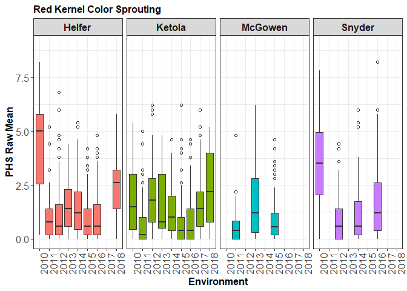

CNL Data Prep and Statistical Analysis PHS
================
S.A. Martinez
2020.04.24

**Data preparation and statistical analysis** of the Cornell Master elite nursery for the Preharvest Sprouting trait using the spike-wetting tests.

This study used a diversity panel of 1,353 lines from the wheat breeding programs at Cornell University (1,032), Michigan State (112), Ohio State (85), and private companies (51) in addition to landraces (14). The diversity panel also consists of 904 (67%) white kernel color and 449 (33%) were red kernelled. Downstream analyses were conducted on either data subset of white kernel color (white), red kernel color (red), and combined (comb or both) kernel color datasets.

> All files in referenced in this document can be downloaded from [CNL\_GWAS\_GP2020](https://github.com/shantel-martinez/CNL_GWAS_GP2020).
> Users will need the following in the same working directory as this CNL\_Prep\_Stats\_PHS.Rmd file: [PHSAll\_Comb\_20181222.csv](https://github.com/shantel-martinez/CNL_GWAS_GP2020/blob/master/PHSAll_Comb_20181222.csv)

PHS Phenotype Files
-------------------

The panel was planted at three locations per year spanning 2008 to 2016, and two locations in 2017 and 2018. The locations rotated between Helfer, Ketola, McGowen, and Snyder near Ithaca, NY.

For each location, 5 spikes/heads were harvested from each plot at physiological maturity. After five and seven days of dry after-ripening for white and red kernel varieties, respectively, the spikes were misted. **Sprouting scores** were taken after 4 days of misting. The sprouting score was based on a 0-9 scale, where a score of 0 had no visible germination and 9 had 100% visible germination and coleoptile extension (McMaster and Derera, 1987).

``` r
rm(list = ls())
PHSComb <- read.csv("../Data Input/PHSAll_Comb_20181222.csv", head = TRUE,na.string=c(""," ","NA","na","NaN"), stringsAsFactors=FALSE) 
PHSComb <- PHSComb[!is.na(PHSComb$RawMean),]
```

> Refer to `PHS Data Exploration.v3.R` to see how I cleaned up and organized the raw phenotype files.

`GID` is a genotype identification number refered to the line tested. The line name is in the `Entry` column.

`Harvest` date at physiological maturity is in Julian Dates, along with the dates `Mist`ed and `Score`d.

`Sprout1`, `Sprout2`,...`Sprout5` refer to the 0-9 score for the 1st spike, 2nd spike, ..., and 5th spike.

The `RawMean` is a raw mean of all 5 sprouting scores.

`Year`, location `Loc`, environment `Env`, days after-ripened `AR`, and `daysMisted` are also included is the data was recorded.

Other agronomic traits may include `PlotYield`, `TW`, `Moisture`, `lodging`, height `Ht`, heading date `HD`, powdery `mildew`, winter hardiness `wh`, and kernel color `KC` if taken.

#### Kernel Color Subsets

Seperating the dataframes into two df: red or white KC based on `$KC` column

``` r
PHSred <- subset(PHSComb, PHSComb$KC=="R" |PHSComb$KC=="r" )
PHSWhite <-subset(PHSComb, PHSComb$KC=="W" |PHSComb$KC=="w" ) 
write.csv(PHSred, "../Data Analysis/CNL_Prep_Stats_PHS_files/PHSAll_Red_20191222.csv",row.names=FALSE)
write.csv(PHSWhite, "../Data Analysis/CNL_Prep_Stats_PHS_files/PHSAll_White_20191222.csv",row.names=FALSE)

length(unique(PHSWhite$GID)) #White subset
```

    ## [1] 797

``` r
length(unique(PHSred$GID)) #Red subset
```

    ## [1] 333

I can seperate out red vs white `subset(PHSComb, PHSComb$KC=="R" |PHSComb$KC=="r" )`

`rbind(HelRed, KetRed, McGRed, SnyRed)` combined all the red dataframes. Followed by the white and combined dataframes.
Any `GID`s with no kernel color indicated was omitted from downstream analysis in order to prevent mixed kernel color samples affecting the results. *It is still possible there was human error in coding kernel color*

Year needs to be treated as a character rather than an integer.

``` r
PHSred$Year<-as.factor(PHSred$Year)
PHSWhite$Year<-as.factor(PHSWhite$Year)
PHSred$RawMean<-as.numeric(PHSred$RawMean)
PHSWhite$RawMean<-as.numeric(PHSWhite$RawMean)
```

QUALITY CHECK: Red kernels were after-ripened for 7 days while white kernels were after-ripened for 5 days. Omit lines that have conflicting AR time points. However, keep the `NAs` because that is a lack of harvest and misting date recording, not necessarily the wrong AR length.
NOTE: the 8 days AR red kernel color days was one year with a reason. That years environment induced more dormancy than usual, so the sames were after-ripened for one more day longer.

``` r
library(plyr)
count(PHSred, "AR") 
PHSred <- subset(PHSred, PHSred$AR!=5| is.na(PHSred$AR)) 
count(PHSWhite, "AR")
PHSWhite <- subset(PHSWhite, PHSWhite$AR!=7| is.na(PHSWhite$AR)) 
```

The combined 'Comb' dataframe is the red and the white kernel datasets all together.

``` r
PHSComb$Year<-as.character(PHSComb$Year)
PHSComb$RawMean<-as.numeric(PHSComb$RawMean)
length(unique(PHSComb$GID)) #Combined subset
```

    ## [1] 1130

Make GID `###` to GID `cuGS###` by adding a new row, then replace text cuGSOH to just `OH` and cuGSMSU to just `MSU`.

``` r
PHSred$GIDx <- with(PHSred,paste("cuGS",PHSred$GID,sep="")) 
PHSred$GIDx <- gsub("cuGSOH", "OH", PHSred$GIDx)
PHSred$GIDx <- gsub("cuGSMSU", "MSU", PHSred$GIDx)
PHSred$GID <- NULL
names(PHSred)[33] <- "GID"
PHSred$GID[17:25]
```

    ## [1] "cuGS17" "cuGS17" "cuGS18" "cuGS18" "cuGS18" "cuGS19" "cuGS19" "cuGS19"
    ## [9] "cuGS21"

``` r
PHSComb$GIDx <- with(PHSComb,paste("cuGS",PHSComb$GID,sep="")) 
PHSComb$GIDx <- gsub("cuGSOH", "OH", PHSComb$GIDx)
PHSComb$GIDx <- gsub("cuGSMSU", "MSU", PHSComb$GIDx)
PHSComb$GID <- NULL
names(PHSComb)[33] <- "GID"

PHSWhite$GIDx <- with(PHSWhite,paste("cuGS",PHSWhite$GID,sep="")) 
PHSWhite$GIDx <- gsub("cuGSOH", "OH", PHSWhite$GIDx)
PHSWhite$GIDx <- gsub("cuGSMSU", "MSU", PHSWhite$GIDx)
PHSWhite$GID <- NULL
names(PHSWhite)[33] <- "GID"

PHSWhite$GID[4500:4505]
```

    ## [1] "MSU92" "MSU92" "MSU92" "MSU94" "MSU94" "MSU94"

#### Harvest date as factor

``` r
PHSred$Harvest <- as.factor(PHSred$Harvest)  
PHSComb$Harvest <- as.factor(PHSComb$Harvest)  
PHSWhite$Harvest <- as.factor(PHSWhite$Harvest)  
```

#### Harvest x Year

I realized hat it would make sense that just using harvest date as a fixed effect is not the full picture. For example, a harvest date of 161 is not going to have the same effect as a harvest date of 161 the following year, even though they are labeled "161". After bringing this up in lab meeting, we have two routes:

1.  If I still plan to solely using `rrBLUP` for my downstream analysis, I may not be able to keep using `kin.blup` because when you defined the fixed effect terms`fixed = c("col1","col2")`, I havent found a way to define col1xcol2 interaction. Therefore, I need to move to `mixed.solve` or `kinship.blup` for my calculations, and create my own design matrix that includes the harvestxyear interaction.

2.  I can create a new column in the datasets that concatenates the year info and the harvest date info. This column will then be defined as a fixed effect. Note that the column would need to be a character or factor now, since the numeric values have no continuous meaning.

``` r
PHSComb$YrHarv <- paste(PHSComb$Year, PHSComb$Harvest, sep = "")
PHSWhite$YrHarv <- paste(PHSWhite$Year, PHSWhite$Harvest, sep = "")
PHSred$YrHarv <- paste(PHSred$Year, PHSred$Harvest, sep = "")
#Need to remove NA harvest dates
#"2008NA" , "2016NA", "2017NA" , "2011NA" 
PHSComb$YrHarv <- gsub("2008NA" , "NA", PHSComb$YrHarv)
PHSComb$YrHarv <- gsub("2016NA", "NA", PHSComb$YrHarv)
PHSComb$YrHarv <- gsub("2017NA" , "NA", PHSComb$YrHarv)
PHSComb$YrHarv <- gsub("2011NA", "NA", PHSComb$YrHarv)

PHSWhite$YrHarv <- gsub("2008NA" , "NA", PHSWhite$YrHarv)
PHSWhite$YrHarv <- gsub("2016NA", "NA", PHSWhite$YrHarv)
PHSWhite$YrHarv <- gsub("2017NA" , "NA", PHSWhite$YrHarv)
PHSWhite$YrHarv <- gsub("2011NA", "NA", PHSWhite$YrHarv)

PHSred$YrHarv <- gsub("2008NA" , "NA", PHSred$YrHarv)
PHSred$YrHarv <- gsub("2016NA", "NA", PHSred$YrHarv)
PHSred$YrHarv <- gsub("2017NA" , "NA", PHSred$YrHarv)
PHSred$YrHarv <- gsub("2011NA", "NA", PHSred$YrHarv)
```

#### Remove all missing

``` r
library(tidyr)
PHSWhiteComplete <- PHSWhite %>% drop_na(HD,Harvest,YrHarv) #goes from 4558 obs to 3970
PHSRedComplete <- PHSred %>% drop_na(HD,Harvest,YrHarv) #2373 obs to 2226
PHSCombComplete <- PHSComb %>% drop_na(HD,Harvest,YrHarv) #6931 obs to 6196
```

#### Raw Mean Summary

``` r
library(ggplot2)
font<-element_text(face = "bold",  size = 12)
font2<-element_text(size = 12)

ggplot(PHSRedComplete, aes(x = PHSRedComplete$Year, y = PHSRedComplete$RawMean)) +
  geom_boxplot(aes(fill = factor(Loc)), outlier.shape = 1)+ theme_bw() +
  facet_grid(.~Loc)+ theme(legend.position="none", axis.text.x = element_text(angle = 90, hjust = 1))+
  theme(axis.text = font2,  axis.title = font,strip.text.x = font,plot.title = font)+
  ylab("PHS Raw Mean") + xlab("Environment")+ guides(fill=FALSE) + ylim(0, 9) +
  ggtitle("Red Kernel Color Sprouting")
```



``` r
#Repeat for PHSWhite and PHSComb
```


Best Fit Model
--------------

### Lowest AIC

Since the data was unbalanced (`PHSWhite`), I can not immeditaely check anova() for models with HD and Harvest, because not all data points have HD or Harvest values, and therefore they are not the same size of dataset.
Which means I needed to subset the data to the values that are complete for HD, Harvest, Env, and so on (`PHSWhiteComplete`). Then reevaluate the models and check for their lower AIC. Is this a valid comparison, if in reality I am using more data for `PHSWhiteVar_3`, versus calculating AIC `anova(PHSWhiteVar_3v2,PHSWhiteVar_4)` with `PHSWhiteVar_3v2` fewer data points?

> Comparing models with [varying samples sizes](https://stats.stackexchange.com/questions/94718/model-comparison-with-aic-based-on-different-sample-size)

After omitting NAs from the dataframes, all models compare:

``` r
library(lme4)
```

    ## Warning: package 'lme4' was built under R version 3.5.3

    ## Loading required package: Matrix

    ## 
    ## Attaching package: 'Matrix'

    ## The following objects are masked from 'package:tidyr':
    ## 
    ##     expand, pack, unpack

``` r
PHSWhiteVar_1 <- lmer(RawMean~(1|GID), data = PHSWhiteComplete) #simple y~x model 
PHSWhiteVar_2 <- lmer(RawMean~(1|GID)+Loc+Year, data = PHSWhiteComplete) 
PHSWhiteVar_3 <- lmer(RawMean~(1|GID)+Env, data = PHSWhiteComplete)
PHSWhiteVar_4 <- lmer(RawMean~(1|GID)+Env+HD+YrHarv, data = PHSWhiteComplete)
```

    ## fixed-effect model matrix is rank deficient so dropping 11 columns / coefficients

``` r
PHSWhiteVar_4b <- lmer(RawMean~(1|GID)+Env+HD, data = PHSWhiteComplete)
PHSWhiteVar_5 <- lmer(RawMean~(1|GID)+Env+HD, data = PHSWhiteComplete)
PHSWhiteVar_7 <- lmer(RawMean~(1|GID)+Env+(1|YrHarv), data = PHSWhiteComplete) #dropping 
PHSWhiteVar_6<- lmer(RawMean~(1|GID)+Env+Year:Harvest+HD, data = PHSWhiteComplete)  #dropping 
```

    ## fixed-effect model matrix is rank deficient so dropping 100 columns / coefficients

``` r
PHSWhiteVar_10 <- lmer(RawMean~(1|GID)+Env+YrHarv, data = PHSWhiteComplete)
```

    ## fixed-effect model matrix is rank deficient so dropping 11 columns / coefficients

``` r
PHSWhiteVar_13 <- lmer(RawMean~(1|GID)+Loc+Year+Year%in%Loc+Year%in%Harvest, data = PHSWhiteComplete)  #dropping 
```

    ## fixed-effect model matrix is rank deficient so dropping 103 columns / coefficients

``` r
PHSWhiteVar_8<- lmer(RawMean~(1|GID)++Loc+Year+Year:Harvest, data = PHSWhiteComplete)  #dropping 
```

    ## fixed-effect model matrix is rank deficient so dropping 88 columns / coefficients

``` r
PHSWhiteVar_11 <- lmer(RawMean~(1|GID)+Loc+(1|Year:Harvest), data = PHSWhiteComplete)  #dropping 
PHSWhiteVar_12 <- lmer(RawMean~(1|GID)+Loc+Year+(1|Year:Harvest), data = PHSWhiteComplete)  #dropping 
PHSWhiteVar_14 <- lmer(RawMean~(1|GID)+Env+(1|Year:Harvest), data = PHSWhiteComplete)  #dropping 
# PHSWhiteVar_15 <- lmer(RawMean~(1|GID)+(1|Year:Harvest), data = PHSWhiteComplete)  #dropping 
PHSWhiteVar_17 <- lmer(RawMean~(1|GID)+(1|Year:Harvest)+Env+HD, data = PHSWhiteComplete)  #dropping

anova(PHSWhiteVar_1,PHSWhiteVar_2)  
```

    ## refitting model(s) with ML (instead of REML)

    ## Data: PHSWhiteComplete
    ## Models:
    ## PHSWhiteVar_1: RawMean ~ (1 | GID)
    ## PHSWhiteVar_2: RawMean ~ (1 | GID) + Loc + Year
    ##               Df   AIC   BIC  logLik deviance  Chisq Chi Df Pr(>Chisq)    
    ## PHSWhiteVar_1  3 14681 14699 -7337.3    14675                             
    ## PHSWhiteVar_2 14 13972 14060 -6971.9    13944 730.73     11  < 2.2e-16 ***
    ## ---
    ## Signif. codes:  0 '***' 0.001 '**' 0.01 '*' 0.05 '.' 0.1 ' ' 1

``` r
anova(PHSWhiteVar_3,PHSWhiteVar_4)  
```

    ## refitting model(s) with ML (instead of REML)

    ## Data: PHSWhiteComplete
    ## Models:
    ## PHSWhiteVar_3: RawMean ~ (1 | GID) + Env
    ## PHSWhiteVar_4: RawMean ~ (1 | GID) + Env + HD + YrHarv
    ##               Df   AIC   BIC  logLik deviance  Chisq Chi Df Pr(>Chisq)    
    ## PHSWhiteVar_3 26 13808 13971 -6877.8    13756                             
    ## PHSWhiteVar_4 44 13240 13517 -6576.3    13152 603.03     18  < 2.2e-16 ***
    ## ---
    ## Signif. codes:  0 '***' 0.001 '**' 0.01 '*' 0.05 '.' 0.1 ' ' 1

``` r
anova(PHSWhiteVar_7,PHSWhiteVar_5)  
```

    ## refitting model(s) with ML (instead of REML)

    ## Data: PHSWhiteComplete
    ## Models:
    ## PHSWhiteVar_7: RawMean ~ (1 | GID) + Env + (1 | YrHarv)
    ## PHSWhiteVar_5: RawMean ~ (1 | GID) + Env + HD
    ##               Df   AIC   BIC  logLik deviance Chisq Chi Df Pr(>Chisq)
    ## PHSWhiteVar_7 27 13369 13539 -6657.6    13315                        
    ## PHSWhiteVar_5 27 13770 13940 -6858.1    13716     0      0          1

``` r
anova(PHSWhiteVar_8,PHSWhiteVar_10) 
```

    ## refitting model(s) with ML (instead of REML)

    ## Data: PHSWhiteComplete
    ## Models:
    ## PHSWhiteVar_8: RawMean ~ (1 | GID) + +Loc + Year + Year:Harvest
    ## PHSWhiteVar_10: RawMean ~ (1 | GID) + Env + YrHarv
    ##                Df   AIC   BIC  logLik deviance  Chisq Chi Df Pr(>Chisq)
    ## PHSWhiteVar_8  34 13342 13555 -6637.0    13274                         
    ## PHSWhiteVar_10 43 13284 13553 -6598.8    13198 76.372      9  8.466e-13
    ##                   
    ## PHSWhiteVar_8     
    ## PHSWhiteVar_10 ***
    ## ---
    ## Signif. codes:  0 '***' 0.001 '**' 0.01 '*' 0.05 '.' 0.1 ' ' 1

``` r
anova(PHSWhiteVar_13,PHSWhiteVar_6) 
```

    ## refitting model(s) with ML (instead of REML)

    ## Data: PHSWhiteComplete
    ## Models:
    ## PHSWhiteVar_13: RawMean ~ (1 | GID) + Loc + Year + Year %in% Loc + Year %in% 
    ## PHSWhiteVar_13:     Harvest
    ## PHSWhiteVar_6: RawMean ~ (1 | GID) + Env + Year:Harvest + HD
    ##                Df   AIC   BIC  logLik deviance  Chisq Chi Df Pr(>Chisq)
    ## PHSWhiteVar_13 43 13284 13553 -6598.8    13198                         
    ## PHSWhiteVar_6  44 13240 13517 -6576.3    13152 45.056      1  1.915e-11
    ##                   
    ## PHSWhiteVar_13    
    ## PHSWhiteVar_6  ***
    ## ---
    ## Signif. codes:  0 '***' 0.001 '**' 0.01 '*' 0.05 '.' 0.1 ' ' 1

``` r
anova(PHSWhiteVar_12,PHSWhiteVar_11)
```

    ## refitting model(s) with ML (instead of REML)

    ## Data: PHSWhiteComplete
    ## Models:
    ## PHSWhiteVar_11: RawMean ~ (1 | GID) + Loc + (1 | Year:Harvest)
    ## PHSWhiteVar_12: RawMean ~ (1 | GID) + Loc + Year + (1 | Year:Harvest)
    ##                Df   AIC   BIC  logLik deviance  Chisq Chi Df Pr(>Chisq)   
    ## PHSWhiteVar_11  7 13432 13476 -6708.9    13418                            
    ## PHSWhiteVar_12 15 13423 13517 -6696.3    13393 25.177      8   0.001451 **
    ## ---
    ## Signif. codes:  0 '***' 0.001 '**' 0.01 '*' 0.05 '.' 0.1 ' ' 1

``` r
anova(PHSWhiteVar_17,PHSWhiteVar_14)
```

    ## refitting model(s) with ML (instead of REML)

    ## Data: PHSWhiteComplete
    ## Models:
    ## PHSWhiteVar_14: RawMean ~ (1 | GID) + Env + (1 | Year:Harvest)
    ## PHSWhiteVar_17: RawMean ~ (1 | GID) + (1 | Year:Harvest) + Env + HD
    ##                Df   AIC   BIC  logLik deviance  Chisq Chi Df Pr(>Chisq)
    ## PHSWhiteVar_14 27 13369 13539 -6657.6    13315                         
    ## PHSWhiteVar_17 28 13326 13502 -6635.1    13270 45.065      1  1.906e-11
    ##                   
    ## PHSWhiteVar_14    
    ## PHSWhiteVar_17 ***
    ## ---
    ## Signif. codes:  0 '***' 0.001 '**' 0.01 '*' 0.05 '.' 0.1 ' ' 1

``` r
anova(PHSWhiteVar_4b,PHSWhiteVar_10) 
```

    ## refitting model(s) with ML (instead of REML)

    ## Data: PHSWhiteComplete
    ## Models:
    ## PHSWhiteVar_4b: RawMean ~ (1 | GID) + Env + HD
    ## PHSWhiteVar_10: RawMean ~ (1 | GID) + Env + YrHarv
    ##                Df   AIC   BIC  logLik deviance  Chisq Chi Df Pr(>Chisq)
    ## PHSWhiteVar_4b 27 13770 13940 -6858.1    13716                         
    ## PHSWhiteVar_10 43 13284 13553 -6598.8    13198 518.58     16  < 2.2e-16
    ##                   
    ## PHSWhiteVar_4b    
    ## PHSWhiteVar_10 ***
    ## ---
    ## Signif. codes:  0 '***' 0.001 '**' 0.01 '*' 0.05 '.' 0.1 ' ' 1

``` r
anova(PHSWhiteVar_10,PHSWhiteVar_4)  
```

    ## refitting model(s) with ML (instead of REML)

    ## Data: PHSWhiteComplete
    ## Models:
    ## PHSWhiteVar_10: RawMean ~ (1 | GID) + Env + YrHarv
    ## PHSWhiteVar_4: RawMean ~ (1 | GID) + Env + HD + YrHarv
    ##                Df   AIC   BIC  logLik deviance  Chisq Chi Df Pr(>Chisq)
    ## PHSWhiteVar_10 43 13284 13553 -6598.8    13198                         
    ## PHSWhiteVar_4  44 13240 13517 -6576.3    13152 45.056      1  1.915e-11
    ##                   
    ## PHSWhiteVar_10    
    ## PHSWhiteVar_4  ***
    ## ---
    ## Signif. codes:  0 '***' 0.001 '**' 0.01 '*' 0.05 '.' 0.1 ' ' 1

Note: not all combinations are shown, but were tested.

Red Kernel datasets

``` r
PHSRedVar_1 <- lmer(RawMean~(1|GID), data = PHSRedComplete) #simple y~x model 
PHSRedVar_2 <- lmer(RawMean~(1|GID)+Loc+Year, data = PHSRedComplete) 
PHSRedVar_3 <- lmer(RawMean~(1|GID)+Env, data = PHSRedComplete)
PHSRedVar_4 <- lmer(RawMean~(1|GID)+Env+HD+YrHarv, data = PHSRedComplete) 
```

    ## fixed-effect model matrix is rank deficient so dropping 11 columns / coefficients

``` r
PHSRedVar_5 <- lmer(RawMean~(1|GID)+Env+HD, data = PHSRedComplete)
PHSRedVar_10 <- lmer(RawMean~(1|GID)+Env+YrHarv, data = PHSRedComplete) 
```

    ## fixed-effect model matrix is rank deficient so dropping 11 columns / coefficients

``` r
PHSRedVar_6 <- lmer(RawMean~(1|GID)+Env+Year%in%Harvest+HD, data = PHSRedComplete) 
```

    ## fixed-effect model matrix is rank deficient so dropping 101 columns / coefficients

``` r
PHSRedVar_7 <- lmer(RawMean~(1|GID)+Env+HD+Harvest, data = PHSRedComplete) 
PHSRedVar_11 <- lmer(RawMean~(1|GID)+Loc+(1|Year:Harvest), data = PHSRedComplete) 
PHSRedVar_12 <- lmer(RawMean~(1|GID)+Loc+Year+(1|Year:Harvest), data = PHSRedComplete) 
PHSRedVar_13 <- lmer(RawMean~(1|GID)+Loc+Year+Year%in%Loc+Year%in%Harvest, data = PHSRedComplete)
```

    ## fixed-effect model matrix is rank deficient so dropping 104 columns / coefficients

``` r
PHSRedVar_14 <- lmer(RawMean~(1|GID)+Env+(1|Year:Harvest), data = PHSRedComplete) 
PHSRedVar_8 <- lmer(RawMean~(1|GID)+Loc+Year+Year:Harvest, data = PHSRedComplete) 
```

    ## fixed-effect model matrix is rank deficient so dropping 89 columns / coefficients

``` r
PHSRedVar_17 <- lmer(RawMean~(1|GID)+(1|Year:Harvest)+Env+HD, data = PHSRedComplete)  #dropping

anova(PHSRedVar_1,PHSRedVar_2)  #PHSRedVar_2 AIC lower
```

    ## refitting model(s) with ML (instead of REML)

    ## Data: PHSRedComplete
    ## Models:
    ## PHSRedVar_1: RawMean ~ (1 | GID)
    ## PHSRedVar_2: RawMean ~ (1 | GID) + Loc + Year
    ##             Df    AIC    BIC  logLik deviance  Chisq Chi Df Pr(>Chisq)    
    ## PHSRedVar_1  3 7799.1 7816.2 -3896.5   7793.1                             
    ## PHSRedVar_2 14 7231.6 7311.5 -3601.8   7203.6 589.46     11  < 2.2e-16 ***
    ## ---
    ## Signif. codes:  0 '***' 0.001 '**' 0.01 '*' 0.05 '.' 0.1 ' ' 1

``` r
anova(PHSRedVar_3,PHSRedVar_2)  #PHSRedVar_3 AIC lower
```

    ## refitting model(s) with ML (instead of REML)

    ## Data: PHSRedComplete
    ## Models:
    ## PHSRedVar_2: RawMean ~ (1 | GID) + Loc + Year
    ## PHSRedVar_3: RawMean ~ (1 | GID) + Env
    ##             Df    AIC    BIC  logLik deviance  Chisq Chi Df Pr(>Chisq)    
    ## PHSRedVar_2 14 7231.6 7311.5 -3601.8   7203.6                             
    ## PHSRedVar_3 26 6995.8 7144.2 -3471.9   6943.8 259.78     12  < 2.2e-16 ***
    ## ---
    ## Signif. codes:  0 '***' 0.001 '**' 0.01 '*' 0.05 '.' 0.1 ' ' 1

``` r
anova(PHSRedVar_3,PHSRedVar_4)  #PHSRedVar_4 AIC lower
```

    ## refitting model(s) with ML (instead of REML)

    ## Data: PHSRedComplete
    ## Models:
    ## PHSRedVar_3: RawMean ~ (1 | GID) + Env
    ## PHSRedVar_4: RawMean ~ (1 | GID) + Env + HD + YrHarv
    ##             Df    AIC    BIC  logLik deviance  Chisq Chi Df Pr(>Chisq)    
    ## PHSRedVar_3 26 6995.8 7144.2 -3471.9   6943.8                             
    ## PHSRedVar_4 43 6659.8 6905.1 -3286.9   6573.8 370.04     17  < 2.2e-16 ***
    ## ---
    ## Signif. codes:  0 '***' 0.001 '**' 0.01 '*' 0.05 '.' 0.1 ' ' 1

``` r
anova(PHSRedVar_4,PHSRedVar_5)  #PHSRedVar_5 AIC lower 
```

    ## refitting model(s) with ML (instead of REML)

    ## Data: PHSRedComplete
    ## Models:
    ## PHSRedVar_5: RawMean ~ (1 | GID) + Env + HD
    ## PHSRedVar_4: RawMean ~ (1 | GID) + Env + HD + YrHarv
    ##             Df    AIC    BIC  logLik deviance  Chisq Chi Df Pr(>Chisq)    
    ## PHSRedVar_5 27 6978.3 7132.4 -3462.2   6924.3                             
    ## PHSRedVar_4 43 6659.8 6905.1 -3286.9   6573.8 350.53     16  < 2.2e-16 ***
    ## ---
    ## Signif. codes:  0 '***' 0.001 '**' 0.01 '*' 0.05 '.' 0.1 ' ' 1

``` r
anova(PHSRedVar_8,PHSRedVar_10) #PHSRedVar_10 AIC lower
```

    ## refitting model(s) with ML (instead of REML)

    ## Data: PHSRedComplete
    ## Models:
    ## PHSRedVar_8: RawMean ~ (1 | GID) + Loc + Year + Year:Harvest
    ## PHSRedVar_10: RawMean ~ (1 | GID) + Env + YrHarv
    ##              Df    AIC    BIC  logLik deviance  Chisq Chi Df Pr(>Chisq)
    ## PHSRedVar_8  33 6859.2 7047.5 -3396.6   6793.2                         
    ## PHSRedVar_10 42 6694.5 6934.1 -3305.3   6610.5 182.71      9  < 2.2e-16
    ##                 
    ## PHSRedVar_8     
    ## PHSRedVar_10 ***
    ## ---
    ## Signif. codes:  0 '***' 0.001 '**' 0.01 '*' 0.05 '.' 0.1 ' ' 1

``` r
anova(PHSRedVar_7,PHSRedVar_6) #PHSRedVar_10 AIC lower
```

    ## refitting model(s) with ML (instead of REML)

    ## Data: PHSRedComplete
    ## Models:
    ## PHSRedVar_7: RawMean ~ (1 | GID) + Env + HD + Harvest
    ## PHSRedVar_6: RawMean ~ (1 | GID) + Env + Year %in% Harvest + HD
    ##             Df    AIC    BIC  logLik deviance  Chisq Chi Df Pr(>Chisq)  
    ## PHSRedVar_7 39 6660.7 6883.2 -3291.3   6582.7                           
    ## PHSRedVar_6 43 6659.8 6905.1 -3286.9   6573.8 8.9062      4    0.06349 .
    ## ---
    ## Signif. codes:  0 '***' 0.001 '**' 0.01 '*' 0.05 '.' 0.1 ' ' 1

``` r
anova(PHSRedVar_14,PHSRedVar_12) #PHSRedVar_10 AIC lower
```

    ## refitting model(s) with ML (instead of REML)

    ## Data: PHSRedComplete
    ## Models:
    ## PHSRedVar_12: RawMean ~ (1 | GID) + Loc + Year + (1 | Year:Harvest)
    ## PHSRedVar_14: RawMean ~ (1 | GID) + Env + (1 | Year:Harvest)
    ##              Df    AIC    BIC  logLik deviance  Chisq Chi Df Pr(>Chisq)
    ## PHSRedVar_12 15 6924.4 7010.0 -3447.2   6894.4                         
    ## PHSRedVar_14 27 6762.3 6916.3 -3354.1   6708.3 186.12     12  < 2.2e-16
    ##                 
    ## PHSRedVar_12    
    ## PHSRedVar_14 ***
    ## ---
    ## Signif. codes:  0 '***' 0.001 '**' 0.01 '*' 0.05 '.' 0.1 ' ' 1

``` r
anova(PHSRedVar_14,PHSRedVar_17) #PHSRedVar_10 AIC lower
```

    ## refitting model(s) with ML (instead of REML)

    ## Data: PHSRedComplete
    ## Models:
    ## PHSRedVar_14: RawMean ~ (1 | GID) + Env + (1 | Year:Harvest)
    ## PHSRedVar_17: RawMean ~ (1 | GID) + (1 | Year:Harvest) + Env + HD
    ##              Df    AIC    BIC  logLik deviance  Chisq Chi Df Pr(>Chisq)
    ## PHSRedVar_14 27 6762.3 6916.3 -3354.1   6708.3                         
    ## PHSRedVar_17 28 6728.6 6888.3 -3336.3   6672.6 35.721      1  2.277e-09
    ##                 
    ## PHSRedVar_14    
    ## PHSRedVar_17 ***
    ## ---
    ## Signif. codes:  0 '***' 0.001 '**' 0.01 '*' 0.05 '.' 0.1 ' ' 1

``` r
anova(PHSRedVar_13,PHSRedVar_11) #PHSRedVar_10 AIC lower
```

    ## refitting model(s) with ML (instead of REML)

    ## Data: PHSRedComplete
    ## Models:
    ## PHSRedVar_11: RawMean ~ (1 | GID) + Loc + (1 | Year:Harvest)
    ## PHSRedVar_13: RawMean ~ (1 | GID) + Loc + Year + Year %in% Loc + Year %in% 
    ## PHSRedVar_13:     Harvest
    ##              Df    AIC    BIC  logLik deviance  Chisq Chi Df Pr(>Chisq)
    ## PHSRedVar_11  7 6944.9 6984.8 -3465.4   6930.9                         
    ## PHSRedVar_13 42 6694.5 6934.1 -3305.3   6610.5 320.36     35  < 2.2e-16
    ##                 
    ## PHSRedVar_11    
    ## PHSRedVar_13 ***
    ## ---
    ## Signif. codes:  0 '***' 0.001 '**' 0.01 '*' 0.05 '.' 0.1 ' ' 1

Combined white and red kernel datasets

``` r
PHSCombVar_1 <- lmer(RawMean~(1|GID), data = PHSCombComplete) #simple y~x model 
PHSCombVar_2 <- lmer(RawMean~(1|GID)+Loc+Year, data = PHSCombComplete) 
PHSCombVar_3 <- lmer(RawMean~(1|GID)+Env, data = PHSCombComplete)
PHSCombVar_4 <- lmer(RawMean~(1|GID)+Env+HD+YrHarv, data = PHSCombComplete) 
PHSCombVar_5 <- lmer(RawMean~(1|GID)+Env+HD, data = PHSCombComplete)
PHSCombVar_10 <- lmer(RawMean~(1|GID)+Env+YrHarv, data = PHSCombComplete) 
PHSCombVar_6 <- lmer(RawMean~(1|GID)+Env+(1|Year:Harvest), data = PHSCombComplete) 
PHSCombVar_7 <- lmer(RawMean~(1|GID)+Env+HD+Harvest, data = PHSCombComplete) 
PHSCombVar_8 <- lmer(RawMean~(1|GID)+Loc+Year+Year:Harvest, data = PHSCombComplete) 

PHSCombVar_15 <- lmer(RawMean~(1|GID)+Env+KC, data = PHSCombComplete)

PHSCombVar_14 <- lmer(RawMean~(1|GID)+Env+(1|Year:Harvest), data = PHSCombComplete)
PHSCombVar_11 <- lmer(RawMean~(1|GID)+Loc+(1|Year:Harvest), data = PHSCombComplete) 
PHSCombVar_12 <- lmer(RawMean~(1|GID)+Loc+Year+(1|Year:Harvest), data = PHSCombComplete) 
PHSCombVar_13 <- lmer(RawMean~(1|GID)+Loc+Year+Year%in%Loc+(1|Year:Harvest), data = PHSCombComplete) 
PHSCombVar_16 <- lmer(RawMean~(1|GID)+Env+(1|Year:Harvest)+HD+KC, data = PHSCombComplete)
PHSCombVar_17 <- lmer(RawMean~(1|GID)+Env+(1|Year:Harvest)+HD, data = PHSCombComplete)

# anova(PHSCombVar_1,PHSCombVar_2)  #PHSCombVar_2 AIC lower
# anova(PHSCombVar_3,PHSCombVar_2)  #PHSCombVar_3 AIC lower
# anova(PHSCombVar_3,PHSCombVar_4)  #PHSCombVar_3 AIC lower
# anova(PHSCombVar_15,PHSCombVar_8)  #PHSCombVar_8 AIC lower
# anova(PHSCombVar_3,PHSCombVar_5)  #PHSCombVar_5 AIC lower
# anova(PHSCombVar_5,PHSCombVar_10) #PHSCombVar_10 AIC lower
# anova(PHSCombVar_7,PHSCombVar_6)  #PHSCombVar_10 AIC lower
# anova(PHSCombVar_17,PHSCombVar_11) #PHSCombVar_10 AIC lower
# anova(PHSCombVar_13,PHSCombVar_12) #PHSCombVar_10 AIC lower
# anova(PHSCombVar_14,PHSCombVar_16) #PHSCombVar_10 AIC lower
```

For all of the models with a Year x harvest interation stated in the equation, there ae many values/columns dropped due to insufficient data. This could be because there was only one or two data points per conditions (i.e., `181_2008` n = 2). By using a concatenated fixed effect (no interaction defined), fewer columns are dropped. The difference of the AIC values between the interaction term `Year:Harvest` and the concatenated `YrHarv` do not appear to be drastic.

Check heritability to see if using either effect in the model changes h2.

### Effect of GenoxEnv interactions

``` r
White_GE <- lmer(RawMean~(1|GID)+Env+(1|GID:Env)+HD+YrHarv, data = PHSWhiteComplete)
```

    ## fixed-effect model matrix is rank deficient so dropping 11 columns / coefficients

``` r
# White_G <- lm(RawMean~GID+Env+HD+Harvest, data = PHSWhiteComplete)
summary(White_GE)
```

    ## Linear mixed model fit by REML ['lmerMod']
    ## Formula: RawMean ~ (1 | GID) + Env + (1 | GID:Env) + HD + YrHarv
    ##    Data: PHSWhiteComplete
    ## 
    ## REML criterion at convergence: 13212.8
    ## 
    ## Scaled residuals: 
    ##     Min      1Q  Median      3Q     Max 
    ## -3.3369 -0.5631 -0.0106  0.5397  3.8095 
    ## 
    ## Random effects:
    ##  Groups   Name        Variance Std.Dev.
    ##  GID:Env  (Intercept) 0.1689   0.4110  
    ##  GID      (Intercept) 0.8782   0.9371  
    ##  Residual             1.1632   1.0785  
    ## Number of obs: 3927, groups:  GID:Env, 3421; GID, 762
    ## 
    ## Fixed effects:
    ##               Estimate Std. Error t value
    ## (Intercept)   20.42212    2.56937   7.948
    ## EnvHel11       2.78069    0.23591  11.787
    ## EnvHel12      -0.42344    0.15687  -2.699
    ## EnvHel13       0.56635    0.47464   1.193
    ## EnvHel14       1.22490    0.29554   4.145
    ## EnvHel15      -0.27433    0.47659  -0.576
    ## EnvHel16       2.34318    0.19172  12.222
    ## EnvHel18       2.00095    0.37630   5.317
    ## EnvKet10       0.47721    0.15267   3.126
    ## EnvKet11       1.07010    0.19658   5.444
    ## EnvKet12      -0.25350    0.20688  -1.225
    ## EnvKet13       1.05370    0.27898   3.777
    ## EnvKet14       1.61463    0.35728   4.519
    ## EnvKet15      -0.12412    0.53931  -0.230
    ## EnvKet16       2.34958    0.24218   9.702
    ## EnvKet17       1.22618    0.18057   6.791
    ## EnvKet18       2.80501    0.54828   5.116
    ## EnvMcG11       2.42076    0.22964  10.541
    ## EnvMcG13       1.56010    0.52255   2.986
    ## EnvMcG15      -0.99957    0.22196  -4.503
    ## EnvSny10      -1.16356    0.16643  -6.991
    ## EnvSny12      -0.71288    0.17540  -4.064
    ## EnvSny14       0.29227    0.22102   1.322
    ## EnvSny16       2.68634    0.16658  16.126
    ## HD            -0.11727    0.01734  -6.761
    ## YrHarv2010186  0.25664    0.17589   1.459
    ## YrHarv2010187  1.62537    0.17515   9.280
    ## YrHarv2011187  0.23747    0.18199   1.305
    ## YrHarv2011188 -1.76744    0.19244  -9.184
    ## YrHarv2012180  0.42817    0.15379   2.784
    ## YrHarv2013189  0.42336    0.32898   1.287
    ## YrHarv2013190  0.75497    0.49407   1.528
    ## YrHarv2014188 -0.87313    0.34857  -2.505
    ## YrHarv2014192 -0.88579    0.26374  -3.359
    ## YrHarv2015189  0.82889    0.20478   4.048
    ## YrHarv2015191  0.36329    0.51940   0.699
    ## YrHarv2015194 -0.12349    0.45652  -0.271
    ## YrHarv2016186 -1.94074    0.17786 -10.912
    ## YrHarv2016187 -2.88942    0.17509 -16.503
    ## YrHarv2016188 -1.12251    0.26689  -4.206
    ## YrHarv2018190 -0.25818    0.54855  -0.471
    ## YrHarv2018192  0.00577    0.36655   0.016

    ## 
    ## Correlation matrix not shown by default, as p = 42 > 12.
    ## Use print(x, correlation=TRUE)  or
    ##     vcov(x)        if you need it

    ## fit warnings:
    ## fixed-effect model matrix is rank deficient so dropping 11 columns / coefficients

``` r
Red_GE <- lmer(RawMean~(1|GID)+Env+(1|GID:Env)+HD+YrHarv, data = PHSRedComplete)
```

    ## fixed-effect model matrix is rank deficient so dropping 11 columns / coefficients

``` r
summary(Red_GE)
```

    ## Linear mixed model fit by REML ['lmerMod']
    ## Formula: RawMean ~ (1 | GID) + Env + (1 | GID:Env) + HD + YrHarv
    ##    Data: PHSRedComplete
    ## 
    ## REML criterion at convergence: 6612.2
    ## 
    ## Scaled residuals: 
    ##     Min      1Q  Median      3Q     Max 
    ## -3.1757 -0.4172 -0.0755  0.3277  3.8175 
    ## 
    ## Random effects:
    ##  Groups   Name        Variance Std.Dev.
    ##  GID:Env  (Intercept) 0.3603   0.6003  
    ##  GID      (Intercept) 0.5646   0.7514  
    ##  Residual             0.5786   0.7606  
    ## Number of obs: 2220, groups:  GID:Env, 2073; GID, 322
    ## 
    ## Fixed effects:
    ##               Estimate Std. Error t value
    ## (Intercept)   19.89135    2.66443   7.466
    ## EnvHel11      -2.59888    0.19868 -13.081
    ## EnvHel12      -3.27817    0.19191 -17.082
    ## EnvHel13      -2.60756    0.53969  -4.832
    ## EnvHel14      -1.86728    0.55487  -3.365
    ## EnvHel15      -3.56034    0.67318  -5.289
    ## EnvHel16      -1.76728    0.21670  -8.155
    ## EnvHel18      -0.96889    0.50931  -1.902
    ## EnvKet10      -2.49695    0.18361 -13.600
    ## EnvKet11      -1.54037    0.49802  -3.093
    ## EnvKet12      -2.40398    0.30680  -7.836
    ## EnvKet13      -1.90775    0.33782  -5.647
    ## EnvKet14      -1.71030    0.60541  -2.825
    ## EnvKet15      -3.40359    0.73745  -4.615
    ## EnvKet16      -1.54937    0.24678  -6.278
    ## EnvKet17      -2.26158    0.18284 -12.369
    ## EnvKet18      -0.22632    0.70599  -0.321
    ## EnvMcG11      -3.11849    0.20052 -15.552
    ## EnvMcG13      -2.73461    0.60529  -4.518
    ## EnvMcG15      -3.38241    0.29099 -11.624
    ## EnvSny10      -1.53462    0.21657  -7.086
    ## EnvSny12      -3.56045    0.26962 -13.206
    ## EnvSny14      -2.10825    0.23920  -8.814
    ## EnvSny16      -0.74038    0.19322  -3.832
    ## HD            -0.10789    0.01818  -5.934
    ## YrHarv2010186  1.38800    0.42620   3.257
    ## YrHarv2010187  1.76219    0.27250   6.467
    ## YrHarv2011187 -1.53019    0.48828  -3.134
    ## YrHarv2012180 -0.26751    0.23885  -1.120
    ## YrHarv2013189 -0.64407    0.40418  -1.594
    ## YrHarv2013190  0.57201    0.54415   1.051
    ## YrHarv2014188 -0.70613    0.58360  -1.210
    ## YrHarv2014192  0.03840    0.52371   0.073
    ## YrHarv2015189  0.12756    0.25193   0.506
    ## YrHarv2015191  0.21388    0.71766   0.298
    ## YrHarv2015194  0.63203    0.65046   0.972
    ## YrHarv2016186 -1.49992    0.16925  -8.862
    ## YrHarv2016187 -2.37705    0.15047 -15.797
    ## YrHarv2016188 -0.77406    0.25260  -3.064
    ## YrHarv2018190 -0.95258    0.69183  -1.377
    ## YrHarv2018192  0.36683    0.46222   0.794

    ## 
    ## Correlation matrix not shown by default, as p = 41 > 12.
    ## Use print(x, correlation=TRUE)  or
    ##     vcov(x)        if you need it

    ## fit warnings:
    ## fixed-effect model matrix is rank deficient so dropping 11 columns / coefficients

### Calculating Heritability

Basic heritability is h2 = Vg / (Vg + Ve), where Vg is the genetic variance `GID Variance` and Ve is the `residual variance` (i.e. variance due to non genetics effects such as environment)

However, since this is an unbalanced dataset, and I'm eventually going to calculate BLUPs, the generalized measure of heritability should be used from [Cullis et al., 2006](https://doi.org/10.1198/108571106X154443)

``` r
Cullis_H2=function(model){
  library(arm)
  ses<- se.ranef(model)$'GID'
  v_BLUP<- ses^2
  sigma2_g=VarCorr(model, comp="Variance")$'GID'[1]
  Reliability<- 1- v_BLUP/ (2*sigma2_g) 
  H2<- round(mean(Reliability),3)
  H2
}
```

where `model` is your defined model object from `lmer`
where `sigma2_g` is the genetic variance estimated with the model saved in `model`
`H2` is equivalent to broad-sense heritability on the line-mean (or family-mean, if your individuals are non-inbred families) basis

Combined dataset h2

``` r
h2_1 <- Cullis_H2(PHSCombVar_1)
h2_2 <- Cullis_H2(PHSCombVar_2)
h2_3 <- Cullis_H2(PHSCombVar_3)
h2_15 <- Cullis_H2(PHSCombVar_15)
h2_4 <- Cullis_H2(PHSCombVar_4)
h2_10 <- Cullis_H2(PHSCombVar_10)
h2_8 <- Cullis_H2(PHSCombVar_8)
h2_14 <- Cullis_H2(PHSCombVar_14)
h2_16 <- Cullis_H2(PHSCombVar_16)
h2_12 <- Cullis_H2(PHSCombVar_12)
h2_11 <- Cullis_H2(PHSCombVar_11)
h2_17 <- Cullis_H2(PHSCombVar_17)

h2 <- c(h2_1, h2_2, h2_3,h2_15, h2_4, h2_10, h2_8,h2_14,h2_16, h2_12,h2_11,h2_17)
print("Comb h2");sprintf('%.2f',h2)
```

    ## [1] "Comb h2"

    ##  [1] "0.87" "0.88" "0.88" "0.80" "0.89" "0.89" "0.89" "0.89" "0.82" "0.89"
    ## [11] "0.89" "0.89"

`RawMean~(1|GID)+Env+HD+YrHarv` gets h2 = 0.89; note that if I use this mixed model, I will lose some data that has HD and Harvest missing. Every time I add KC into my mixed model, h2 drastically reduces (0.89 to 0.80). The residual is much higher compared to the genetic variance. This is even after combing through the data for unclear kernel color observations and omitting any conflicting data points.

Repeat for white and red kernel color datasets

    ## [1] "White h2 : h2_1, h2_2, h2_3, h2_4, h2_10, h2_6, h2_8,h2_14, h2_12,h2_11,h2_17"

    ##  [1] "0.77" "0.80" "0.81" "0.82" "0.83" "0.82" "0.83" "0.83" "0.83" "0.83"
    ## [11] "0.82"

    ## [1] "Red h2 : h2_1, h2_2, h2_3, h2_4, h2_10, h2_6, h2_8,h2_14, h2_12,h2_11,h2_17"

    ##  [1] "0.80" "0.83" "0.85" "0.86" "0.87" "0.86" "0.86" "0.87" "0.86" "0.86"
    ## [11] "0.86"

`RawMean~(1|GID)+Env+HD+YrHarv` gets h2 = 0.82 for white KC and 0.86 for red KC; note that if I use this mixed model, I will lose a lot of data that has HD and Harvest missing, however the model fit is better with increased h2.

### BLUP Analysis

Once we have the model covariates we wish to use `RawMean~(1|GID)+Env+HD+YrHarv`, then we can calculate the BLUPs using that model.

``` r
blup <- ranef(PHSWhiteVar_4,drop=TRUE)
y <- attributes(blup[[1]])

blup_W <- data.frame(blup[["GID"]])
rownames(blup_W) <- y$`names`
blup_W$GID <- rownames(blup_W)


blup <- ranef(PHSRedVar_4,drop=TRUE)
y <- attributes(blup[[1]])

blup_r <- data.frame(blup[["GID"]])
rownames(blup_r) <- y$names
blup_r$GID <- rownames(blup_r)

blup <- ranef(PHSCombVar_4,drop=TRUE)
y <- attributes(blup[[1]])

blup_C <- data.frame(blup[["GID"]])
rownames(blup_C) <- y$names
blup_C$GID <- rownames(blup_C)
```

Now `PHScGIDblup` `PHSwGIDblup` and `PHSrGIDblup` are the dataframes with BLUP values in col \[1\] and the GID names in the row names.
However, we will be comparing Comb, Red, and White df to one another, therefore a new column `KC` needs to be defined to differentiate the three.

``` r
PHSwGIDblup <-  blup_W
PHScGIDblup <-  blup_C
PHSrGIDblup <-  blup_r
PHScGIDblup$KC <- "Comb"
PHSrGIDblup$KC <- "Red"
PHSwGIDblup$KC <- "White"
PHScGIDblup$GID <- row.names(PHScGIDblup)
PHSrGIDblup$GID <- row.names(PHSrGIDblup)
PHSwGIDblup$GID <- row.names(PHSwGIDblup)
```

### BLUP and Raw plot

Plot the raw means within each environment and the BLUPs across all environments.

``` r
a <- ggplot(PHSWhiteComplete, aes(x = PHSWhiteComplete$Year, y = PHSWhiteComplete$RawMean))+
  geom_boxplot(aes(fill = factor(Loc)), outlier.shape = 1)+ theme_bw() +
  facet_grid(.~Loc)+ theme(legend.position="none", axis.text.x = element_text(angle = 90, vjust = 0.4))+
  theme(axis.text = font2,  axis.title = font,strip.text.x = font,plot.title = font)+
  ylab("Sprout Raw Mean") + xlab("Environment")+ guides(fill=FALSE) + ylim(0, 9) +
  ggtitle("a)")+scale_fill_grey()

PHSwGIDblup$Env <- "All Env"
b <- ggplot(PHSwGIDblup, aes(PHSwGIDblup$KC, PHSwGIDblup$blup...GID...)) +
  geom_boxplot(aes(fill = factor(KC)))+ theme_bw() +
    scale_fill_manual(values="#FFD39B")+
  theme(axis.text = font2,  axis.title = font, strip.text.x = font, 
        plot.title = font, legend.position = "none", axis.text.x = element_text(angle = 90, vjust = 0.4))+
  ylab("Sprout BLUP") + xlab("") + ylim(-3,3)+
  facet_grid(.~Env)+ggtitle("b)")+
  annotate("text", x =1, y = -2.5, label = paste("italic(h) ^ 2 == ",h2w),  parse = TRUE,size =6)

c <- ggplot(PHSRedComplete, aes(x = PHSRedComplete$Year, y = PHSRedComplete$RawMean))+
  geom_boxplot(aes(fill = factor(Loc)), outlier.shape = 1)+ theme_bw() +
  facet_grid(.~Loc)+ theme(legend.position="none", axis.text.x = element_text(angle = 90, vjust = 0.4))+
  theme(axis.text = font2,  
        axis.title = font,
        strip.text.x = font,
        plot.title = font)+
  ylab("Sprout Raw Mean") + xlab("Environment")+ guides(fill=FALSE) + ylim(0, 9) +
  ggtitle("c)")+scale_fill_grey()

PHSrGIDblup$Env <- "All Env"
d <- ggplot(PHSrGIDblup, aes(PHSrGIDblup$KC, PHSrGIDblup$blup...GID...)) +
  geom_boxplot(aes(fill = factor(KC)))+ theme_bw() +
    scale_fill_manual(values="#8B0000")+
  theme(axis.text = font2,  axis.title = font, strip.text.x = font, 
        plot.title = font, legend.position = "none", axis.text.x = element_text(angle = 90, vjust = 0.4))+
  ylab("Sprout BLUP") + xlab("") + ylim(-3,3)+
  facet_grid(.~Env)+ggtitle("D)")+
  annotate("text", x =1, y = -2.5, label = paste("italic(h) ^ 2 == ",h2r),  parse = TRUE,size =6)

library(gridExtra)
a <- a+ xlab("")
p <- grid.arrange(a, b, c,d, nrow = 2,  widths = c(5, 1),heights = c(14,12))
```


``` r
ggsave("../Data Analysis/CNL_Prep_Stats_PHS_files/SproutMeans20200409.png", plot =p,width = 16, height = 12, units = "in")
```

Summary plot with Genetic data
------------------------------

``` r
myGD <- read.csv("../Data Input/myGD.csv", head = TRUE,na.string=c(""," ","NA","na","NaN"))
rownames(myGD) = myGD[,1]
PHSWhite1 <- subset(PHSWhiteComplete, GID %in% myGD$X)
PHSWhite1$Loc <- gsub("McGowen","McGowan",PHSWhite1$Loc)

PHSred1 <- subset(PHSRedComplete, GID %in% myGD$X)
PHSred1$Loc <- gsub("McGowen","McGowan",PHSred1$Loc)

PHSrGIDblup <- subset(PHSrGIDblup, GID %in% myGD$X)
PHSwGIDblup <- subset(PHSwGIDblup, GID %in% myGD$X)
```

``` r
dat_text <- data.frame(
          label = c("116  190   180    51    120    212   174    25",
                    "151  199   189    56   120    183   148    74    25",
                    "200   102   183",
                    "147   179   120   168"),
          Loc = c("Helfer", "Ketola", "McGowan", "Snyder"))


a <- ggplot(PHSWhite1, aes(x = PHSWhite1$Year, y = PHSWhite1$RawMean))+
  geom_boxplot(aes(fill = factor(Loc)), outlier.shape = 1)+ theme_bw() +
  facet_grid(.~Loc, scales='free', space='free_x')+ 
  theme(legend.position="none", 
        panel.grid.minor = element_blank(), 
        panel.grid.major.x = element_blank(),
        axis.text.x = element_text(angle = 90, vjust = 0.4),
        axis.text = element_text(size = 16),  
        axis.title = element_text(size = 16),
        strip.text.x = element_text(face = "bold",  size = 16),
        plot.title = element_text(face = "bold",  size = 16))+
  ylab("Naive Sprouting Mean") + xlab("")+ 
  guides(fill=FALSE) + 
  ggtitle("a)")+scale_fill_grey()+
  geom_text(data = dat_text,mapping = aes(x =0.4, y = 9, label = label, colour = "#3E78B2"),
            size=6, vjust = 0.5, hjust = -0.05)+ 
    scale_y_continuous(breaks=seq(0, 9, 1)) +
  scale_color_manual(values = "#3E78B2") 

PHSwGIDblup$Env <- "All Env"
b <- ggplot(PHSwGIDblup, aes(PHSwGIDblup$KC, PHSwGIDblup$blup...GID...)) +
  geom_boxplot(aes(fill = factor(KC)))+ theme_bw() +
    scale_fill_manual(values="#FFD39B")+
  theme(legend.position="none", 
        panel.grid.minor = element_blank(), 
        panel.grid.major.x = element_blank(),
        axis.text.x = element_text(angle = 90, vjust = 0.4),
        axis.text = element_text(size = 16),  
        axis.title = element_text(size = 16),
        strip.text.x = element_text(face = "bold",  size = 16),
        plot.title = element_text(face = "bold",  size = 16))+
  ylab("Sprout BLUP") + xlab("") + #ylim(-3,3)+
  facet_grid(.~Env)+ggtitle("b)")+
  annotate("text", x =1, y = -2.3, label = paste("italic(H)[C]^2 == ",h2w),  parse = TRUE,size =6)+ 
    scale_y_continuous(breaks=seq(-3, 3, 1)) 


dat_text <- data.frame(
          label = c("55   73     79      29     84    155   186    21",
                    "57   67     77      25     84    134   179    97   21",
                    "63    23    133",
                    "57    71    84    182"),
          Loc = c("Helfer", "Ketola", "McGowan", "Snyder"))

c <- ggplot(PHSred1, aes(x = PHSred1$Year, y = PHSred1$RawMean))+
  geom_boxplot(aes(fill = factor(Loc)), outlier.shape = 1)+ theme_bw() +
  facet_grid(.~Loc, scales='free', space='free_x')+ 
  theme(legend.position="none", 
        panel.grid.minor = element_blank(), 
        panel.grid.major.x = element_blank(),
        axis.text.x = element_text(angle = 90, vjust = 0.4),
        axis.text = element_text(size = 16),  
        axis.title = element_text(size = 16),
        strip.text.x = element_text(face = "bold",  size = 16),
        plot.title = element_text(face = "bold",  size = 16))+
  ylab("Naive Sprouting Mean") + xlab("")+ 
  guides(fill=FALSE) +
  ggtitle("c)")+scale_fill_grey()+
  geom_text(data = dat_text,mapping = aes(x =0.5, y = 9, label = label, colour = "#3E78B2"),
            size=6, vjust = 0.5, hjust = -0.05)+ 
    scale_y_continuous(breaks=seq(0, 9, 1))+
  scale_color_manual(values = "#3E78B2")

PHSrGIDblup$Env <- "All Env"
d <- ggplot(PHSrGIDblup, aes(PHSrGIDblup$KC, PHSrGIDblup$blup...GID...)) +
  geom_boxplot(aes(fill = factor(KC)))+ theme_bw() +
    scale_fill_manual(values="#8B0000")+
  theme(legend.position="none",
        panel.grid.major.x = element_blank(),
        panel.grid.minor = element_blank(), 
        axis.text.x = element_text(angle = 90, vjust = 0.4),
        axis.text = element_text(size = 16),  
        axis.title = element_text(size = 16),
        strip.text.x = element_text(face = "bold",  size = 16),
        plot.title = element_text(face = "bold",  size = 16))+
  ylab("Sprout BLUP") + xlab("") + #ylim(-3,3)+
  facet_grid(.~Env)+ggtitle("d)")+
  annotate("text", x =1, y = -2.3, label = paste("italic(H)[C]^2 == ",h2r),  parse = TRUE,size =6)+ 
    scale_y_continuous(breaks=seq(-3, 3, 1)) 

library(gridExtra)
p <- grid.arrange(a, b, c,d, nrow = 2,  widths = c(6, 1),heights = c(14,14))
```


``` r
ggsave("../Data Analysis/CNL_Prep_Stats_PHS_files/SproutMeansGID_20200420.jpg", plot =p,width = 18, height = 11, units = "in")
```

### Unbalanced Nature of Breeding Program

``` r
library(tidyverse)
```

    ## Warning: package 'tidyverse' was built under R version 3.5.3

    ## -- Attaching packages --------------------------------------- tidyverse 1.2.1 --

    ## v tibble  2.1.1     v dplyr   0.8.3
    ## v readr   1.3.1     v stringr 1.4.0
    ## v purrr   0.3.2     v forcats 0.4.0

    ## Warning: package 'tibble' was built under R version 3.5.3

    ## Warning: package 'readr' was built under R version 3.5.3

    ## Warning: package 'purrr' was built under R version 3.5.3

    ## Warning: package 'dplyr' was built under R version 3.5.3

    ## Warning: package 'stringr' was built under R version 3.5.3

    ## Warning: package 'forcats' was built under R version 3.5.3

    ## -- Conflicts ------------------------------------------ tidyverse_conflicts() --
    ## x dplyr::combine() masks gridExtra::combine()
    ## x Matrix::expand() masks tidyr::expand()
    ## x dplyr::filter()  masks stats::filter()
    ## x dplyr::lag()     masks stats::lag()
    ## x Matrix::pack()   masks tidyr::pack()
    ## x dplyr::select()  masks MASS::select()
    ## x Matrix::unpack() masks tidyr::unpack()

``` r
p <- PHSCombComplete %>%
  group_by(GID)%>%
  tally() %>%
  ggplot(aes(x = n)) +
    geom_histogram()+
    stat_bin(geom="text", aes(label=..count..) , vjust = -0.5)+ 
    scale_x_continuous(breaks = seq(0 , 160, 10 ))
p
```

    ## `stat_bin()` using `bins = 30`. Pick better value with `binwidth`.

    ## `stat_bin()` using `bins = 30`. Pick better value with `binwidth`.


------------------------------------------------------------------------

Before we move any further to downstream analysis, we've accumulated a lot of dataframes in our environment while prepping the three BLUP dataframes.

Tidy up the global environment to only include `PHScGIDblup`, `PHSwGIDblup` , and `PHSrGIDblup` .

``` r
rm(list= ls()[!(ls() %in% c('PHScGIDblup','PHSwGIDblup','PHSrGIDblup','PHSWhiteComplete','PHSCombComplete','PHSRedComplete'))])
save.image(file="CNL_Prep_Stats_PHS.RData")
```
